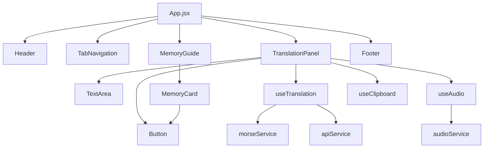

# 🎵 Morsify

<div align="center">


**Master the art of Morse code with our advanced translator, memory guides, and audio features**

[](https://morsify-sahil.vercel.app)
[](https://github.com/sahilbakshi3/Morsify/stargazers)
[](https://github.com/sahilbakshi3/Morsify/issues)
[](https://github.com/sahilbakshi3/Morsify/blob/main/LICENSE)

</div>

---

## 📖 Table of Contents

- [✨ Features](#-features)
- [🚀 Demo](#-demo)
- [💻 Installation](#-installation)
- [📁 Project Structure](#-project-structure)
- [🛠️ Tech Stack](#️-tech-stack)
- [🎵 Audio Features](#-audio-features)
- [🧠 Memory Learning System](#-memory-learning-system)
- [🔧 Configuration](#-configuration)
- [🌐 API Integration](#-api-integration)
- [📱 Screenshots](#-screenshots)
- [🤝 Contributing](#-contributing)
- [📄 License](#-license)
- [👨‍💻 Author](#-author)

---

## ✨ Features

### 🔄 **Dual Translation Modes**
- **Text to Morse**: Convert any text into Morse code
- **Morse to Text**: Decode Morse code back to readable text
- **Real-time Translation**: Instant conversion as you type

### 🎵 **Advanced Audio System**
- **Realistic Morse Sounds**: Authentic dot and dash audio playback
- **Individual Letter Playback**: Learn pronunciation for each character
- **Configurable Audio**: Toggle sound on/off with visual feedback

### 🧠 **Interactive Learning Guide**
- **Memory Cards**: 26 letters with memorable phrases
- **Mnemonic Devices**: Easy-to-remember patterns (lowercase = dot, CAPS = dash)
- **Visual Learning**: Color-coded Morse patterns
- **Audio Reinforcement**: Click to hear each letter's sound

### 🎨 **Modern UI/UX**
- **Glass Morphism Design**: Beautiful translucent panels with backdrop blur
- **Gradient Backgrounds**: Stunning color transitions
- **Responsive Layout**: Perfect on desktop, tablet, and mobile
- **Smooth Animations**: Polished hover effects and transitions
- **Dark Theme**: Easy on the eyes for extended learning

### ⚡ **Smart Features**
- **Copy to Clipboard**: One-click sharing of translations
- **API Integration**: Primary translation via FunTranslations API
- **Offline Fallback**: Built-in dictionary when API is unavailable
- **Error Handling**: Graceful degradation and user feedback
- **Input Validation**: Smart error detection and suggestions

---

## 🚀 Demo

🌐 **Live Application**: [https://morsify-omega.vercel.app/](https://morsify-omega.vercel.app/)

### Try it now:
1. Enter text like "HELLO WORLD"
2. Click "Translate" to see: `.... . .-.. .-.. --- / .-- --- .-. .-.. -.`
3. Enable audio to hear the Morse code!
4. Use the Memory Guide to learn patterns

---

## 💻 Installation

### Prerequisites
- **Node.js** (version 14.0 or higher)
- **npm** or **yarn** package manager

### Quick Start

```bash
# Clone the repository
git clone https://github.com/sahilbakshi3/Morsify.git

# Navigate to project directory
cd Morsify

# Install dependencies
npm install

# Install Tailwind CSS and PostCSS (if not already installed)
npm install -D tailwindcss postcss autoprefixer

# Start development server
npm start
```

### Build for Production

```bash
# Create optimized build
npm run build

# Serve build locally (optional)
npx serve -s build
```

The app will be available at `http://localhost:3000` 🎉

---

## 📁 Project Structure

```
Morsify/
├── 📁 public/
│   ├── index.html                 # HTML template
│   ├── favicon.ico               # App favicon
│   └── manifest.json             # PWA manifest
│
├── 📁 src/
│   ├── 📁 components/            # React components
│   │   ├── 📁 Header/
│   │   │   ├── Header.jsx        # App header with title
│   │   │   └── index.js          # Export file
│   │   │
│   │   ├── 📁 TabNavigation/
│   │   │   ├── TabNavigation.jsx # Tab switching component
│   │   │   └── index.js
│   │   │
│   │   ├── 📁 TranslationPanel/
│   │   │   ├── TranslationPanel.jsx  # Main translation interface
│   │   │   └── index.js
│   │   │
│   │   ├── 📁 MemoryGuide/
│   │   │   ├── MemoryGuide.jsx   # Learning guide container
│   │   │   ├── MemoryCard.jsx    # Individual learning cards
│   │   │   └── index.js
│   │   │
│   │   ├── 📁 Footer/
│   │   │   ├── Footer.jsx        # App footer
│   │   │   └── index.js
│   │   │
│   │   └── 📁 common/            # Reusable UI components
│   │       ├── 📁 Button/
│   │       │   ├── Button.jsx    # Styled button component
│   │       │   └── index.js
│   │       │
│   │       └── 📁 TextArea/
│   │           ├── TextArea.jsx  # Custom textarea component
│   │           └── index.js
│   │
│   ├── 📁 services/              # Business logic
│   │   ├── morseService.js       # Morse code translation logic
│   │   ├── audioService.js       # Web Audio API integration
│   │   └── apiService.js         # External API calls
│   │
│   ├── 📁 hooks/                 # Custom React hooks
│   │   ├── useAudio.js          # Audio state management
│   │   ├── useClipboard.js      # Clipboard operations
│   │   └── useTranslation.js    # Translation logic
│   │
│   ├── 📁 constants/            # App constants
│   │   ├── morseCode.js         # Morse code dictionary
│   │   └── memoryGuide.js       # Learning phrases data
│   │
│   ├── 📁 utils/                # Utility functions
│   │   ├── helpers.js           # General helper functions
│   │   └── validators.js        # Input validation
│   │
│   ├── 📁 styles/               # Styling files
│   │   ├── globals.css          # Global styles + Tailwind imports
│   │   └── components.css       # Component-specific styles
│   │
│   ├── App.jsx                  # Main app component
│   ├── App.css                  # App-specific styles
│   └── index.js                 # React app entry point
│
├── 📄 tailwind.config.js        # Tailwind CSS configuration
├── 📄 postcss.config.js         # PostCSS configuration
├── 📄 package.json              # Dependencies and scripts
├── 📄 README.md                 # Project documentation
└── 📄 .gitignore               # Git ignore rules
```

### 🗂️ Component Architecture



---

## 🛠️ Tech Stack

### Frontend
-  **React 19** - Modern UI framework with hooks
-  **Tailwind CSS** - Utility-first styling
-  **Lucide React** - Beautiful icon library

### APIs & Services
- 🌐 **FunTranslations API** - Primary translation service
- 🎵 **Web Audio API** - Real-time audio generation
- 📋 **Clipboard API** - Copy functionality

### Build Tools
- ⚡ **Create React App** - Zero-config build setup
- 📦 **PostCSS** - CSS processing
- 🎨 **Autoprefixer** - CSS vendor prefixes

### Deployment
- ☁️ **Vercel** - Seamless deployment and hosting

---

## 🎵 Audio Features

### Real-time Morse Code Playback
```javascript
// Example of audio generation
const playMorseCode = (morseString) => {
  // Dots: 100ms beep
  // Dashes: 300ms beep  
  // Letter spacing: 200ms pause
  // Word spacing: 500ms pause
};
```

### Configurable Audio Settings
- **Frequency**: 600Hz sine wave (authentic Morse sound)
- **Timing**: Standard international timing ratios
- **Volume**: 30% for comfortable listening
- **Toggle**: Easy on/off switching

---

## 🧠 Memory Learning System

### Mnemonic Method
Each letter has a memorable phrase where:
- **lowercase letters** = dots (.)
- **UPPERCASE LETTERS** = dashes (-)

### Examples
- **A** `.-` → "**a**bout" (lowercase + uppercase)
- **B** `-...` → "**BOOK** is very good" 
- **C** `-.-.` → "**CO**de **M****Or**se **CO**de"

### Learning Features
- 📚 **26 Interactive Cards** - One for each letter
- 🎵 **Audio Playback** - Hear each pattern
- 🎨 **Visual Coding** - Color-coded dots and dashes
- 🔄 **Progressive Learning** - Start with common letters

---

## 🔧 Configuration

### Morse Code Settings
Edit `src/constants/morseCode.js`:
```javascript
export const DOT_DURATION = 100;     // Dot length (ms)
export const DASH_DURATION = 300;    // Dash length (ms)  
export const PAUSE_DURATION = 100;   // Between dots/dashes
export const LETTER_PAUSE = 200;     // Between letters
export const WORD_PAUSE = 500;       // Between words
export const AUDIO_FREQUENCY = 600;  // Tone frequency (Hz)
```

### Styling Customization
Edit `tailwind.config.js`:
```javascript
module.exports = {
  theme: {
    extend: {
      colors: {
        // Add custom colors
        'morse-blue': '#0EA5E9',
        'morse-purple': '#8B5CF6',
      },
      animation: {
        // Add custom animations
        'morse-pulse': 'pulse 2s infinite',
      }
    },
  },
}
```

---

## 🌐 API Integration

### Primary: FunTranslations API
- **Text to Morse**: `api.funtranslations.com/translate/english2morse.json`
- **Morse to Text**: `api.funtranslations.com/translate/morse2english.json`
- **Rate Limiting**: Graceful handling of API limits

### Fallback: Offline Dictionary
- **Complete A-Z mapping** - All letters and numbers
- **Special Characters** - Punctuation and symbols  
- **Error Recovery** - Seamless fallback when API fails

### Usage Example
```javascript
// API call with fallback
const result = await translateWithAPI(text, true);
if (!result.success) {
  // Automatically falls back to offline translation
  return textToMorse(text);
}
```

---

## 📱 Screenshots

### Main Interface


### Memory Guide


### Mobile View


---

## 🤝 Contributing

We love contributions! Here's how you can help make Morsify even better:

### 🐛 Bug Reports
Found a bug? [Open an issue](https://github.com/sahilbakshi3/Morsify/issues/new) with:
- Clear description of the problem
- Steps to reproduce
- Expected vs actual behavior
- Browser/device information

### ✨ Feature Requests
Have an idea? [Create a feature request](https://github.com/sahilbakshi3/Morsify/issues/new) with:
- Detailed description of the feature
- Use case and benefits
- Mockups or examples (if applicable)

### 🔧 Pull Requests

1. **Fork** the repository
2. **Create** a feature branch:
   ```bash
   git checkout -b feature/amazing-feature
   ```
3. **Make** your changes
4. **Test** thoroughly
5. **Commit** with clear messages:
   ```bash
   git commit -m "Add: Amazing new feature"
   ```
6. **Push** to your branch:
   ```bash
   git push origin feature/amazing-feature
   ```
7. **Open** a Pull Request

### 📋 Development Guidelines
- Follow existing code style
- Add comments for complex logic
- Update tests for new features
- Ensure responsive design
- Test on multiple browsers

---

## 📄 License

This project is licensed under the **MIT License** - see the [LICENSE](LICENSE) file for details.

```
MIT License - Feel free to use, modify, and distribute!
```

---

## 👨‍💻 Author

<div align="center">

**Sahil Bakshi**

[](https://github.com/sahilbakshi3)
[](https://linkedin.com/in/sahilbakshi3)
[](https://sahilbakshi.dev)

</div>

---

## 🙏 Acknowledgments

- 🎵 **Original Inspiration**: [Morse Code Memory Guide Video](https://youtu.be/D8tPkb98Fkk?si=a8Dmf6OsBYNEMdrF)
- 🌐 **Translation API**: [FunTranslations](https://funtranslations.com/)
- 🎨 **Design Inspiration**: Modern glass morphism trends
- 📚 **Learning Method**: International Morse Code standards
- 🔧 **Build Tools**: Create React App team
- 💎 **UI Framework**: Tailwind CSS community

---

## 📈 Project Stats


---

<div align="center">

**⭐ Star this repo if you found it helpful! ⭐**

**Made with ❤️ and lots of ☕**

</div>